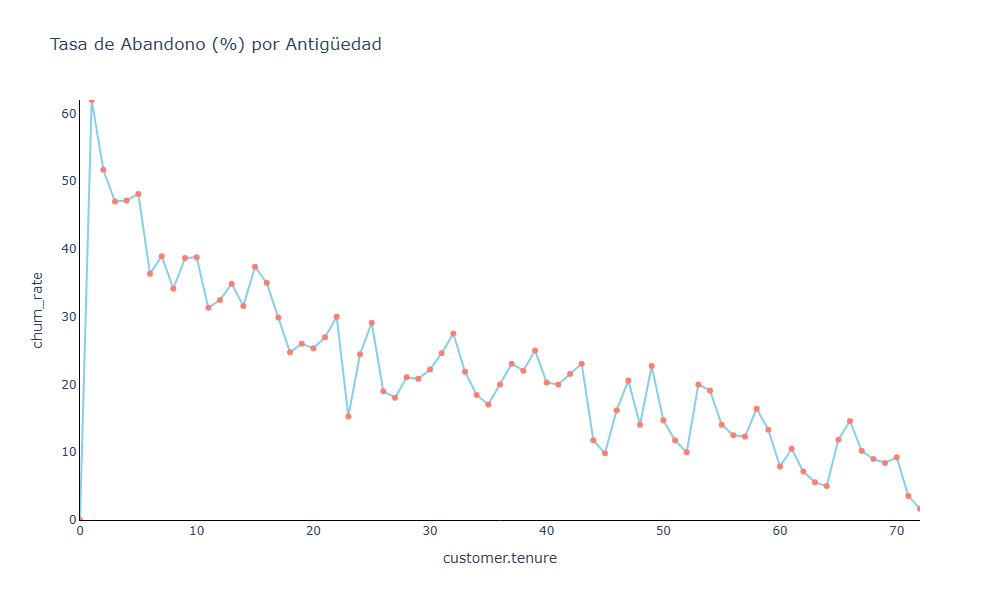
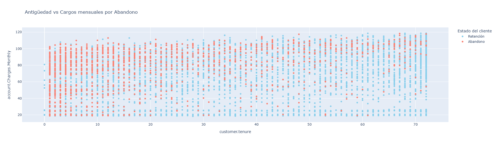

# TelecomX LATAM - ETL y Análisis de Clientes

## About
Análisis ETL de "Telecom X": limpieza de datos, transformación y visualización de patrones de abandono, cargos y tenure (antigüedad) para mejorar estrategias de retención. Los datos y la empresa son ficticios y forman parte de un curso de formación.

## Contenido del repositorio
Este repositorio contiene los siguientes archivos:

- `TelecomX_LATAM.ipynb` : Notebook con el proceso ETL completo, incluyendo limpieza, normalización, cálculo de métricas y visualizaciones.
- `TelecomX_Data_Limpio.csv` : Dataset limpio y transformado.
- Carpeta `graficos/` : Contiene los gráficos generados durante el análisis:
  - Histograma de abandono por Tenure
  - Tasa de Abandono (%) por Antigüedad
  - Antigüedad vs Cargos mensuales por Abandono
  - Distribución de Cargos Mensuales según Estado del Cliente
  - Abandono por género
  - Abandono por método de pago
  - Abandono por tipo de Streaming TV
  - Abandono por tipo de servicio de internet
  - Abandono por tipo de contrato
  - Porcentaje de abandono de clientes

## Objetivos del ETL
1. Limpiar datos inconsistentes (NaNs y strings vacíos en `Churn` y cargos totales).
2. Normalizar columnas binarias y generar métricas derivadas (p. ej. `Cuentas_Diarias`).
3. Agrupar y preparar los datos para análisis de abandono y comportamiento de clientes.
4. Visualizar patrones clave que influyen en el churn, cargos mensuales y tenure.

## Visualizaciones destacadas
Algunos de los gráficos más relevantes generados en el análisis:


*Figura 1: Tasa de Abandono según la antigüedad del cliente.*


*Figura 2: Relación entre antigüedad y cargos mensuales según abandono.*

## Uso
1. Clonar el repositorio:
```bash
git clone https://github.com/Akiri12/Telecom_X_Alura.git

